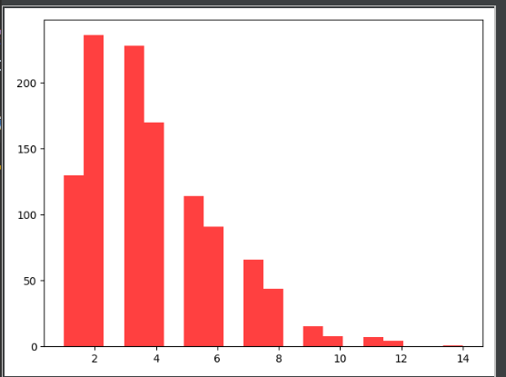
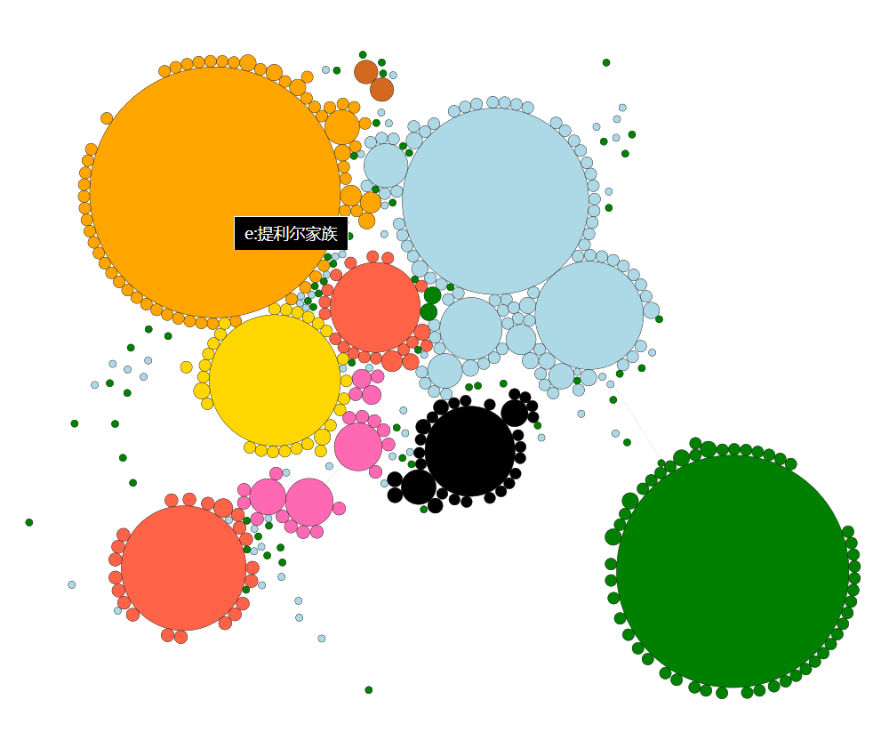

# OpenKG-for-Game-of-Thrones
A python project for creating an openKG for Game of Thrones.

## OpenKG访问链接

http://openkg.cn/dataset/game-of-thrones

## Github访问链接

https://github.com/fishfishfishfishfish/OpenKG-for-Game-of-Thrones

## 项目流程
本项目计划构建小说《冰与火之歌》（A song of ice and fire）中的人物、家族、城堡的知识图谱。我们先从维基网站上抓取相关的三元组，构成初步的知识图谱。由于网页上的文本存在一定的错误、不对应，我们进行了一些数据清洗。同时网页上的实体关系并不完整，我们通过推理的方式将图谱中可以由规则补全的部分进行补全。之后我们使用关系抽取的方式，从小说原文中学习出关系抽取的模型，并用该模型抽取出原来图谱中没有的实体关系。最后我们使用网页的方式展示整个知识图谱。

主要包括三部分工作：（1）数据爬虫获取（2）数据预处理与关系抽取（3）关系逻辑推理与知识图谱可视化；下面各部分工作介绍如下：

### 数据获取

> `triple_crawler.py`中的代码负责数据抓取以及清理
>
> `entity_linking.py`中的代码负责寻找出小说文本中的实体
>
> `tail matching.py`中的代码负责实体消减部分的工作

#### 文件描述

`asoiaf.ttl`：清洗后的三元组文件，这里面的三元组可以认为都是对的

`candidate_entity_replacement_list_v6.jsonl`：三元组以及识别出来替换尾实体的实体，识别不一定正确

`candidate_entity_replacement_list_v5.jsonl`：三元组以及识别出来替换尾实体的实体，替换实体记录了多个候选实体，例如对于三元组`e:乔佛里·拜拉席恩, r:继承人, 托曼一世`，记录了可能替换`托曼一世`的多个实体：`['e:乔佛里·瓦列利安', 'e:托曼·兰尼斯特一世', 'e:托曼·徒利', 'e:托曼·拜拉席恩', 'e:乔斯琳·拜拉席恩']`。进行匹配时可以匹配这些实体来代替`托曼一世`。之所以要这样主要还是没找到好的方法筛选出正确的实体。每个三元组候选实体的数目不一，最多有14个。

`asoiaf_after_inference.ttl`：推理补全后的知识图谱，具体做法见**知识图谱的推理补全**部分。

`graphs_json/`文件夹：图谱可视化相关文件，具体使用见**知识图谱可视化**的部分。

#### 三元组的抓取

从网站[冰与火之歌中文维基](https://asoiaf.huijiwiki.com/wiki/冰与火之歌中文维基)上抓取需要的三元组信息。

先从三个列表网页上抓取人物列表、城堡列表、家族列表

- [Category:人物](https://asoiaf.huijiwiki.com/wiki/Category:%E4%BA%BA%E7%89%A9)：抓取人物列表
- [Category:贵族家族](https://asoiaf.huijiwiki.com/wiki/Category:%E8%B4%B5%E6%97%8F%E5%AE%B6%E6%97%8F)：抓取家族列表
- [Category:城堡](https://asoiaf.huijiwiki.com/wiki/Category:%E5%9F%8E%E5%A0%A1)：抓取城堡列表

通过上述的列表，可以得到每个人物、家族或城堡对应的页面的url。以人物、家族和城堡组成初级的实体，在他们的页面上抓取相关的关系。主要是从页面上的信息栏提取关系数据。以人物`提利昂·兰尼斯特`为例，网页上的信息栏如下：

 

我们从这个信息栏中可以提取出以下三元组：

```
e:提利昂·兰尼斯特	r:头衔	"前御前首相".
e:提利昂·兰尼斯特	r:头衔	"前财政大臣".
e:提利昂·兰尼斯特	r:势力	e:兰尼斯特家族.
e:提利昂·兰尼斯特	r:势力	"次子团".
e:提利昂·兰尼斯特	r:宗教	"七神信仰".
e:提利昂·兰尼斯特	r:别名	"小恶魔".
e:提利昂·兰尼斯特	r:别名	"半人、半人提利昂".
e:提利昂·兰尼斯特	r:别名	"Boyman".
e:提利昂·兰尼斯特	r:别名	"耶罗".
e:提利昂·兰尼斯特	r:别名	"胡戈·希山".
e:提利昂·兰尼斯特	r:出生	"273AC，出生于凯岩城".
e:提利昂·兰尼斯特	r:配偶	"第一任，泰莎".
e:提利昂·兰尼斯特	r:配偶	"第二任，珊莎·史塔克".
e:提利昂·兰尼斯特	r:好友	e:波隆.
e:提利昂·兰尼斯特	r:不和	e:瑟曦·兰尼斯特.
e:提利昂·兰尼斯特	r:恋情	e:雪伊.
```

同时，为了方便之后在文本中的匹配，我们为每个实体添加了`name`、`名`、`姓`、`type`四个关系。`type`的尾实体可以取`character`、`castle`或`house`分别对应人物、城堡、家族。例如上述的实体，我们额外添加了四个三元组表示这四个关系：

```
e:提利昂·兰尼斯特	r:name	"提利昂·兰尼斯特".
e:提利昂·兰尼斯特	r:type	"character".
e:提利昂·兰尼斯特	r:名	"提利昂".
e:提利昂·兰尼斯特	r:姓	"兰尼斯特".
```

#### 三元组的清洗

- 将繁体字统一为简体

- 替换三个关系：

  ```
  `r:王后` -> `r:配偶`
  `r:继承者` -> `r:继承人`
  `r:丈夫` -> `r:配偶`
  ```

- 更正抓取的错误：

  ```
  e:乔佛里·拜拉席恩	r:全称	"拜拉席恩家族和兰尼斯特家族的乔佛里一世".
  e:兰尼斯特家族	r:封号	"凯岩王".
  e:兰尼斯特家族	r:封号	"凯岩城公爵".
  e:兰尼斯特家族	r:封号	"兰尼斯港之盾".
  e:兰尼斯特家族	r:封号	"西境守护".
  e:兰尼斯特家族	r:封号	"西境统领".
  e:兰尼斯特家族	r:创建	"机灵的兰恩创建于英雄纪元".
  ```

- 去掉原著書目\原著书目、第*季、出场集数、出场季数、提及集数。

- 去掉纯英语的三元组

- 形成三元组文件：`asoiaf.ttl`

##### 统计信息

抓取的这些初级实体共有2,870个，其中人物实体有2,260个，家族有439个，城堡有171个。三元组共有19,103个。7,399个尾实体无法匹配实体，以字符串的形式记录。

#### literal实体的消减

抓取、清洗后的三元组中存在一些没能与现有实体匹配的literal实体。为了使得三元组能更好地匹配到句子，考虑将literal的实体替换成现有的实体。例如`e:托曼·拜拉席恩   r:父亲   "詹姆·兰尼斯特（事实）".`中的尾实体`"詹姆·兰尼斯特（事实）"`替换为现有的人物实体`e:詹姆·兰尼斯特`。这样在寻找三元组对应的句子时就不用直接匹配`"詹姆·兰尼斯特（事实）"`，而是可以匹配`e:詹姆·兰尼斯特`的名、别名等。

##### 具体方法

记需要替换尾实体的三元组为`s r o`。现有的所有实体集合记为$E$

1. `o`与$E$中每个实体计算相似度

   `o`与某一实体$e$的相似度为：`o`与`e.name​`的莱文斯坦比 + `o`与`e.name`的最长公共子串长度/(len(`o`)+len(`e.name`))

2. `s`与$E$中每个实体计算相似度

   `s`与某一实体$e$的相似度为：`s.name`与`e.name`的莱文斯坦比 + `s.name`与$e.name$的最长公共子串长度/(len(`s.name`)+len(`e.name`))

3. 将上述两个相似度都大于0.4的实体都记录下来作为候选实体。假如有三元组没有两个相似度都大于0.4的候选实体，则找出1个两个相似度都大于0.1的实体作为候选实体。再没有的话则该三元组不考虑进行尾实体的替换。

4. 每个候选实体`e`都去文本中计算和头实体`s`的共现次数

5. 根据上述计算，对于一个三元组，可以得到一组候选实体，每个候选实体有三个特征值：与`o`的相似度；与`s`的相似度；与`s`的共现次数

6. 利用每个候选实体的三个特征值，找出候选实体中的skyline点。经过这一步筛选候选实体数量统计如下：

     

7. 为了在上面的skyline实体中进一步选出一个用于替换的实体，我们考虑寻找skyline实体中的lower bound。

   具体方法是将skyline实体分别按照三个属性值进行排序，并找出在这三个排序中都处于前k个的实体。通过不断降低k的值，直到剩下一个实体即为用于替换的实体

   假如上述做法没能找出唯一一个实体用于替换，则考虑只使用与`o`的相似度；与`s`的共现次数两个属性计算lower bound

   若仍不能找出唯一一个替换实体，则使用与`o`的相似度最大的那个skyline实体进行替换

8. 通过1-7步得到的替换实体记录在文件`candidate_entity_replacement_list_v6.jsonl`中，每一行为一个三元组，用字典表示。key`s`、`r`、`o`分别是原来三元组的主谓宾，`candidate_entity`为选出来替换`o`的实体

10. 第7步选出的替换实体中仍有一部分是错误的。因此我们也将每个三元组第6步选出的skyline实体记录到文件`candidate_entity_replacement_list_v5.jsonl`，到句子里匹配三元组的时候，可以认为匹配到任意一个skyline实体都是匹配到了`o`

实体消减后主要用于输入到关系抽取阶段中。

> 

### 数据预处理与关系抽取

基于网络爬虫获取到的人物实体、家族实体、地点实体、以及相关实体之间的绝对正确的三元组关系等数据，我们在该部分对所获取的数据进行数据预处理，转化为可以提供给模型进行学习的训练集，测试集，验证集；并应用models文件夹内的bert.py以及bertEntity.py两个文件的深度神经网络模型对相应的数据集进行关系抽取的训练、验证与预测。

#### 小说文本转化为可训练的样本
1. 利用根目录下的process_crawled_triples.py 文件将抽取到并初步清洗后存储于preprocessed_data文件夹下的candidate_entity_replacement_list_v5.jsonl和asoiaf.ttl进行进一步的深度处理，生成需要在文本分词时特别标注的candidate entity与true entity（输出到preprocessed_data/literal_vocabulary），以及preprocessed_data/ent2id.json文件，使得一个实体的不同表达能够被映射到统一的id上。

2. 利用根目录下的preprocessor.py文件对raw_data文件夹下的小说文本.xhtml进行解析、并利用Hanlp中的NLPTokenizer进行分词，分词过程中注意向词典内加入上一步处理的得到的candidate entity与true entity使其能够在样本生成时被标出；解析完成的文件输出到preprocessed_data/preprocessed_data.jsonl内；总计68064条样本句子，每一行代表一个样本，具体格式如下：

        {"text": "小说中的一段话（按xhtml中的<p></p>标签计算为一段话）",
         "hanlp_tokens": hanlp分词list,
         "hanlp_pos": hanlp分词标识（如nr, true_entity等词语类型）,
         "meta": {"source": "句子来源文件名", 
                  "chapter": "句子来源章节名", 
                  "id": 顺序分配}}

3. 利用根目录下的tag_entity.py文件对解析好的文件进行实体与三元组关系的标注，与实体对样本生成。特别注意的是，在该部分我们尝试了删除句子中的停用词的操作，但后来发现目前大部分的中文关系抽取的方法并没有对停用词进行处理，而且删除停用词可能会影响语义的连贯性，于是最终操作是并没有过滤停用词的。

   我们对一句话中的所有识别到的nr（Hanlp中的人名标识）、true_entity以及candidate_entity三种类型的词语进行排列组合，使得每个样本只有一对实体。沿袭**远距离监督**的思想，如果这个实体对在我们网络爬虫爬到的关系三元组中存在对应的关系，我们将该样本标记为对应到的三元组关系。按照这样的思想，我们共得到了92592条实体对样本，其中, 840条被标注为有三元组关系的（共25种关系被匹配到，包括其反向关系，如父亲（e1,e2)与父亲（e2,e1))，91752条为没有找到网络数据匹配的三元组关系的(这部分为我们重点希望再抽取到新的三元组关系的），最终我们按照7:1:2的比例生成训练集，验证集以及测试集，存储于datasets/GOT/corpus_train.jsonl、datasets/GOT/corpus_dev.jsonl、datasets/GOT/corpus_eval.jsonl中。文件中每一行代表一个样本，一个实体对样本的格式如下：
   
       {"text": "小说中的一段话（按xhtml中的<p></p>标签计算为一段话）", 
        "hanlp_tokens":  hanlp分词list,
        "hanlp_pos": hanlp分词标识（如nr, true_entity等词语类型）,
        "meta": {"source": "句子来源文件名", 
                      "chapter": "句子来源章节名", 
                      "id": 顺序分配},
        "token": 过滤的hanlp分词list, 
        "filtered_pos": 过滤的hanlp分词标识, 
        "ents": [[实体name文本, 实体标识（true_entity/candidate_entity/nr*\）, 分词list中index], 
                 [实体name文本, 实体标识（true_entity/candidate_entity/nr*\）, 分词list中index]], 
        "label": 关系标签id, 
        "h": {"name": 头实体文本, "pos": [头实体起始位置, 头实体结束位置], "tag": 头实体标识（true_entity/candidate_entity/nr*\）},
        "t": {"name": 尾实体文本, "pos": [尾实体起始位置, 尾实体结束位置], "tag": 尾实体标识（true_entity/candidate_entity/nr*\）}}

#### 模型训练与新关系的抽取生成
考虑到网络爬虫获得关系三元组能够在小说文本中匹配到的句子样本的数量非常有限；我们决定先利用数据量比较充足的CCKS人物关系抽取任务（https://biendata.com/competition/ccks_2019_ipre/）中的数据集fine-tune预训练的bert模型，使其具备关系抽取的能力；而后利用fine-tune好的bert模型测试在权力的游戏小说文本上，查看其能够抽取到的相关人物关系（此时所抽取的关系类型数量以及名称由训练数据集，即datasets/CCKS-IPRE文件夹下的相应train文件决定）。

训练模型的命令为：

     python notransfer_main.py

保持默认参数即可。

利用训练好的模型，我们对小说文本进行CCKS-IPRE任务所定义的人物关系的发现，最终生成8163条新的关系三元组，并存储于snapshot/source_True_pred_notNoneCCKS_triples.jsonl文件中；另外，考虑到Hanlp本身识别到的nr词语不一定是真正的人物实体，我们特别只关注了我们自己爬取到的true_entity及其相关变体candidate_entity。在8163条新的关系三元组中，存在3003条属于只发生在true_entity或candidate_entity之间的三元组记录（另外，存储为source_True_pred_notNoneCCKS_triples_notNR.jsonl）。

### 知识图谱的推理补全

#### 开发与运行环境 

Windows 下使用 java 与 jena 包，java 版本为 12.0.2，jena 版本为 3.13.1。 

#### 模型创建： 

使用 jena 中的𝑀𝑜𝑑𝑒𝑙𝐹𝑎𝑐𝑡𝑜𝑟𝑦工具创建一个默认𝑀𝑜𝑑𝑒𝑙。 
使用 jena 中的𝐹𝑖𝑙𝑒𝑀𝑎𝑛𝑎𝑔𝑒𝑟工具自动将 ttl 文件读入创建的𝑀𝑜𝑑𝑒𝑙中。 
模型创建细节如下图： 
 

#### 推理实现： 

1. 考虑三元组中的所有 51 个关系，观察到关系“兄弟姐妹”可以进行推理。 即若:
   `<A, 兄弟姐妹，B>`  `<B，兄弟姐妹，C>`
   则应有： 
   `<A，兄弟姐妹，C>` 
   基于此，对`asoiaf.ttl`中的全部 19103 条三元组进行推理，采用的方法是将所有的关系是“兄弟姐妹”的实体进行统计，若两个实体之间之前不存在“兄弟姐妹”的关系，便新建一个关系为
   “兄弟姐妹”的三元组到𝑀𝑜𝑑𝑒𝑙中。 
   经过处理，一共新得到 1034 条关系为“兄弟姐妹”的三元组 
2. 考虑三元组中的所有 51 个关系，观察到关系“母亲”、“父亲”、“配偶”可以进行推理。 即若： 
   `<A, 母亲，B>`  `<A，父亲，C>` 
   则应有： 
   `<B，配偶，C>` 
   基于此，对 `asoiaf.ttl` 中的全部 19103 条三元组进行推理，采用的方法是将所有的关系是“母亲”与“父亲”的实体进行统计，若 B 与 C 之间之前不存在“配偶”的关系，边新建一个关系为“配
   偶”的三元组到𝑀𝑜𝑑𝑒𝑙中。 
   经过处理，一共新得到 4 条关系为“配偶”的三元组。 
3. 推理补全后的三元组存储在`asoiaf_after_inference.ttl`中

### 知识图谱的可视化

> `entity_clustering.py`中的文件负责对知识图谱中的实体进行聚类，以及page rank的计算

先使用pagerank对图谱中的实体网络进行节点重要性的计算，得到每个实体的重要性。同时对实体网络进行谱聚类，得到实体的分类。

使用javascript将图谱用网页的形式展示。图中圆表示实体，圆的大小表示实体pagerank得到的重要性程度，圆的颜色是谱聚类后实体的分类。

下图是对所有家族实体进行pagerank以及谱聚类后的结果，可以进入`graphs_json\house_graph`文件夹后，在当前文件夹运行`python JS_graph.py`，之后访问`http://localhost:8000`可打开网页查看图谱。鼠标停留在圆上方可查看实体名称。

  

下图是对所有城堡实体进行pagerank以及谱聚类后的结果，可以进入`graphs_json\castle_graph`文件夹后，在当前文件夹运行`python JS_graph.py`，之后访问`http://localhost:8000`可打开网页查看图谱。鼠标停留在圆上方可查看实体名称。从图中可以看到，小说中各个城堡之间是没有直接链接的边的，城堡之间一般不会发生关系，都是通过家族或人物间接联系。


 

下图是对所有人物实体进行pagerank以及谱聚类后的结果，可以进入`graphs_json\character_graph`文件夹后，在当前文件夹运行`python JS_graph.py`，之后访问`http://localhost:8000`可打开网页查看图谱。鼠标停留在圆上方可查看实体名称。

  

下图是对所有人物实体进行pagerank以及谱聚类后的结果，可以进入`graphs_json\all_graph`文件夹后，在当前文件夹运行`python JS_graph.py`，之后访问`http://localhost:8000`可打开网页查看图谱。鼠标停留在圆上方可查看实体名称。

 

