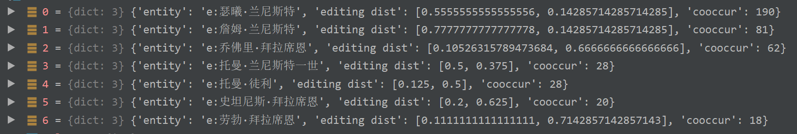
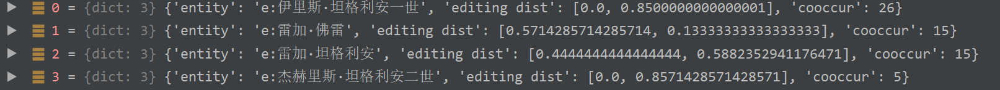

`{'s': 'e:雷顿·海塔尔', 'r': 'r:势力', 'o': '海塔尔家族', 'candidate_entity': 'e:昆顿·海塔尔'}`

`{'s': 'e:托曼·拜拉席恩', 'r': 'r:父亲', 'o': '詹姆·兰尼斯特（事实）', 'candidate_entity': 'e:托曼·兰尼斯特一世'}`




`{'s': 'e:伊里斯·坦格利安二世', 'r': 'r:子嗣', 'o': '雷加', 'candidate_entity': 'e:雷加·佛雷'}`



 


 


```
'sentence': ['然而', '今晚', '是', '个', '例外', '，', '迥异', '往昔', '，', '四方', '暗幕', '中', '有', '种', '莫可名状', '、', '让', '他', '汗毛', '竖立', '的', '惊悚', '。', '他们', '轻骑', '北', '出', '长城', '，', '中途', '转向', '西北', '，', '随即', '又', '向', '北', '，', '九天', '来', '昼夜', '加急', '、', '不断', '推进', '，', '紧咬', '一队', '土匪', '的', '足迹', '。', '环境', '日益', '恶化', '，', '今天', '已', '降到', '谷底', '。', '阴森', '北风', '吹', '得', '树影', '幢幢', '，', '宛如', '狰狞', '活物', '，', '威尔', '整天', '都', '觉得', '自己', '受到', '一', '种', '冰冷', '且', '对', '他', '毫无', '好感', '的', '莫名之物', '监视', '，', '盖瑞', '也', '感觉', '出', '了', '。', '此刻', '威尔', '心中', '只', '想', '掉转', '马头', '，', '没命', '似的', '逃回', '长城', '。', '但', '这', '却是', '万万不能', '在', '长官', '面前', '说出', '的', '念头', '。'], 
's': 'e:威尔', 
's_offset': '97', 
'o': '守夜人',
'o_offset': '72', 
'r': 'r:势力'
```

这条生成的监督数据，`o`中的`守夜人`似乎出错。原因是，在寻找三元组`威尔 势力 守夜人`对应的句子时，匹配`守夜人`的词语包括`守夜人`的的candidate entity。因为`守夜人`的candidate实体中由于存在多个名称为`威尔`的实体，这些实体也在句子中`威尔`

```
{'text': '然而今晚是个例外，迥异往昔，四方暗幕中有种莫可名状、让他汗毛竖立的惊悚。他们轻骑北出长城，中途转向西北，随即又向北，九天来昼夜加急、不断推进，紧咬一队土匪的足迹。环境日益恶化，今天已降到谷底。阴森北风吹得树影幢幢，宛如狰狞活物，威尔整天都觉得自己受到一种冰冷且对他毫无好感的莫名之物监视，盖瑞也感觉出了。此刻威尔心中只想掉转马头，没命似的逃回长城。但这却是万万不能在长官面前说出的念头。', 'hanlp_tokens': ['然而', '今晚', '是', '个', '例外', '，', '迥异', '往昔', '，', '四方', '暗幕', '中', '有', '种', '莫可名状', '、', '让', '他', '汗毛', '竖立', '的', '惊悚', '。', '他们', '轻骑', '北', '出', '长城', '，', '中途', '转向', '西北', '，', '随即', '又', '向', '北', '，', '九天', '来', '昼夜', '加急', '、', '不断', '推进', '，', '紧咬', '一队', '土匪', '的', '足迹', '。', '环境', '日益', '恶化', '，', '今天', '已', '降到', '谷底', '。', '阴森', '北风', '吹', '得', '树影', '幢幢', '，', '宛如', '狰狞', '活物', '，', '威尔', '整天', '都', '觉得', '自己', '受到', '一', '种', '冰冷', '且', '对', '他', '毫无', '好感', '的', '莫名之物', '监视', '，', '盖瑞', '也', '感觉', '出', '了', '。', '此刻', '威尔', '心中', '只', '想', '掉转', '马头', '，', '没命', '似的', '逃回', '长城', '。', '但', '这', '却是', '万万不能', '在', '长官', '面前', '说出', '的', '念头', '。'], 'hanlp_pos': ['stopwords', 't', 'stopwords', 'stopwords', 'n', 'stopwords', 'z', 't', 'stopwords', 'n',...
```

