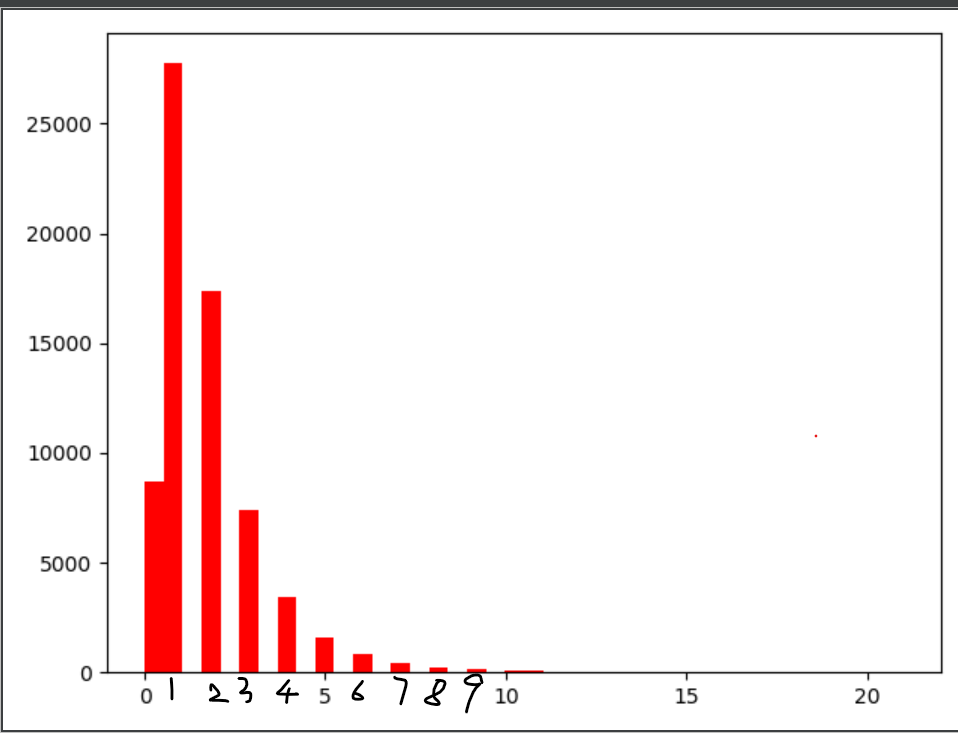

##### processed_data/preprocessed_data_with_entity.jsonl

有匹配到实体的词语, 每个词语平均有4.031763189622916个匹配实体。

共有68064条句子，其中36348条是只有一个词语匹配到实体

##### processed_data/candidate_entity_by_editing_dist_v0.jsonl
threshold = 0.5

共有1517个literal,有502个literal没有匹配到实体, 每个literal平均匹配到8.560975609756097,一个literal(兰尼斯特家族)最多匹配到122个实体

##### processed_data/candidate_entity_by_editing_dist_v1.jsonl
threshold = 0.8。若没有匹配到词语，则threshold降低为0.5。若再没有匹配到，则threshold降低为0.1

共有1517个literal,有10个literal没有匹配到实体, 每个literal平均匹配到42.130520764667104,一个literal(托伦斯·蒂格)最多匹配到2157个实体

##### processed_data/candidate_entity_by_editing_dist_v2.jsonl
threshold = 0.8

共有1517个literal,有1055个literal没有匹配到实体, 每个literal平均匹配到0.7073170731707317,一个literal(琼恩)最多匹配到24个实体

##### processed_data/candidate_entity_by_editing_dist_v3.jsonl
threshold = 0.8。若没有匹配到词语，则threshold降低为0.1, k=10。

共有1517个literal,有10个literal没有匹配到实体, 每个literal平均匹配到8.412656558998023,一个literal(劳勃一世)最多匹配到25个实体

##### processed_data/candidate_entity_by_editing_dist_v4.jsonl
threshold = 0.8。若没有匹配到词语，则threshold降低为0.1, k=1。

共有1517个literal,有10个literal没有匹配到实体, 每个literal平均匹配到1.6216216216216217,一个literal(琼恩)最多匹配到24个实体

##### processed_data/candidate_entity_by_editing_dist_and_cooccur_v1.jsonl
在processed_data/candidate_entity_by_editing_dist_v4.jsonl的基础上统计实体的共现频率

##### processed_data/candidate_entity_by_editing_dist_v5.jsonl
前面的方法中, literal与实体的name、别名、名进行匹配。这里则去掉与“名”这一属性的匹配，literal只与实体的name、别名进行匹配，计算编辑距离

threshold = 0.8。若没有匹配到词语，则threshold降低为0.1, k=1。

共有1517个literal,有10个literal没有匹配到实体, 每个literal平均匹配到1.025049439683586,一个literal(加尔斯·园丁)最多匹配到7个实体

##### processed_data/candidate_entity_by_editing_dist_and_cooccur_v2.jsonl
在processed_data/candidate_entity_by_editing_dist_v5.jsonl的基础上统计实体的共现频率

##### processed_data/candidate_entity_by_editing_dist_v6.jsonl
前面的方法中, literal与实体的name、别名、名进行匹配。这里则去掉与“名”这一属性的匹配，literal只与实体的name、别名进行匹配，计算编辑距离

threshold = 0.4。若没有匹配到词语，则threshold降低为0.1, k=10。

共有1517个literal,有10个literal没有匹配到实体, 每个literal平均匹配到1.025049439683586,一个literal(加尔斯·园丁)最多匹配到7个实体

##### processed_data/candidate_entity_by_editing_dist_and_cooccur_v3.jsonl
在processed_data/candidate_entity_by_editing_dist_v6.jsonl的基础上统计实体的共现频率

##### processed_data/candidate_entity_by_editing_dist_v7.jsonl
在processed_data/candidate_entity_by_editing_dist_v6.jsonl的基础上。修改了triple与word相似度的计算。
使用的图谱数据为triples/asoif.2001021955.ttl
相似度不只考虑要替换的literal与实体的关系，也考虑对应的头实体与要用来替换的实体的name上的关系。
同时字符串相似度除了莱文斯坦比，还添加了最长公共子串

threshold = 0.4。若没有匹配到词语，则threshold降低为0.1, k=10。

共有1532个literal,有0个literal没有匹配到实体, 每个literal平均匹配到11.27023498694517,一个literal(拜拉席恩家族)最多匹配到337个实体

##### processed_data/preprocessed_data_with_entity_v1.jsonl
使用的图谱数据为triples/asoif.2001021955.ttl, 
使用的矩阵文件为processed_data/preprocessed_data.jsonl,
在句子中匹配实体。
共有句子68064句，其中8672句没有匹配到实体，27747句匹配到1个实体，17374句匹配到2个实体，

 

##### processed_data/candidate_entity_by_editing_dist_v8.jsonl
在processed_data/candidate_entity_by_editing_dist_v7.jsonl的基础上，去掉与头实体完全一样的匹配
同时候选用于替换的实体, 与一个三元组与头实体 尾实体的相似度是分开计算的

共有1532个literal,有18个literal没有匹配到实体, 每个literal平均匹配到62.63642297650131,一个literal(拜拉席恩家族)最多匹配到372个实体

##### processed_data/candidate_entity_by_editing_dist_and_cooccur_v4.jsonl
在processed_data/candidate_entity_by_editing_dist_v8.jsonl的基础上, 计算实体的共现次数

##### processed_data/candidate_entity_replacement_list_v4.jsonl
processed_data/candidate_entity_by_editing_dist_and_cooccur_v4.jsonl的基础上选出替换的实体
筛选可替换实体的标准：
与尾实体的相似度大于0.7，或与头实体、尾实体的相似度均大于0.4且与头实体有共现次数

##### processed_data/candidate_entity_replacement_list_v5.jsonl
processed_data/candidate_entity_by_editing_dist_and_cooccur_v4.jsonl的基础上选出替换的实体
筛选可替换实体的标准：
根据a:与尾实体的相似度 b:与头实体的相似度 c:与头实体的共现次数找出候选实体中的skyline
将这些skyline实体记录下来

##### processed_data/candidate_entity_replacement_list_v6.jsonl
processed_data/candidate_entity_replacement_list_v5.jsonl的基础上
找出的多个skyline点上，先通过寻找三个属性值上的lowerbound的那个实体，若能得到唯一一个结果则该结果就为替换实体
若不能，则在a和c属性上重新寻找lowerbound
若仍不能得到唯一一个结果，则选择a属性最大的实体